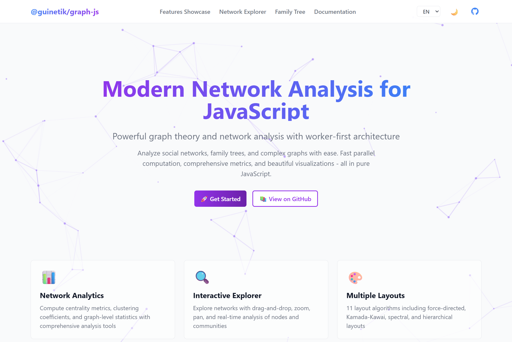

# graph-js

> **Modern Network Analysis for JavaScript**
> A high-performance graph theory library with interactive demos and worker-first architecture.




<div align="center">

[](https://www.npmjs.com/package/@guinetik/graph-js)
[](https://opensource.org/licenses/MIT)

[**Library Documentation**](./graph-js/README.md) | [**Live Demo**](#-interactive-demos) | [**API Reference**](./graph-js/README.md#api-reference)

</div>

---

## 🎯 Project Overview

**graph-js** is a comprehensive network analysis toolkit consisting of:

1. **[@guinetik/graph-js](./graph-js/)** - The core library for network analysis and graph algorithms
2. **[Interactive Demos](./graph-js-demos/)** - A full-featured Vue 3 application showcasing the library's capabilities

This project brings powerful graph theory and network analysis to JavaScript with an emphasis on **performance**, **usability**, and **visual exploration**.

### 📜 Evolution from js-network-stats

**graph-js** is a complete rewrite and evolution of the original [**js-network-stats**](https://github.com/guinetik/js-network-stats) project:

**js-network-stats (v1.0)** - The humble beginnings:
- 🎯 **Purpose**: Simple Node.js micro-package for serverless functions
- 🔧 **Architecture**: Relied on JSNetworkX for graph operations
- 📦 **Scope**: Batch operations for computing network metrics
- 🌐 **Environment**: Node.js only

**graph-js (v2.0+)** - The next generation:
- 🚀 **Worker-First**: Custom implementation with Web Workers for parallel computation
- 🌍 **Universal**: Works in both browser and Node.js environments
- 🎨 **Rich Features**: 11 layouts, multiple adapters, interactive demos
- 📊 **Comprehensive**: Graph-level statistics, community detection, visualization tools
- 🔄 **Modern Stack**: TypeScript support, ESM modules, Vue 3 demos
- 🌐 **Bilingual**: English and Portuguese documentation

The rewrite enabled significant performance improvements (2-3x speedup), browser compatibility, and a much richer feature set while maintaining the simplicity of the original API.

---

## ✨ Key Features

### 🚀 Core Library Features

- **Worker-First Architecture** - All computation runs in Web Workers for non-blocking UI
- **Comprehensive Metrics** - 8+ centrality measures and graph-level statistics
- **Community Detection** - Louvain algorithm with modularity optimization
- **11 Layout Algorithms** - From force-directed to spectral layouts
- **Data Adapters** - CSV, JSON (D3/Cytoscape), and NetworkX compatibility
- **TypeScript Support** - Full type definitions included
- **2-3x Performance Boost** - Parallel computation on large graphs

### 🎨 Interactive Demo Features

- **Network Explorer** - Upload and analyze your own networks (CSV, JSON, NetworkX)
- **Features Showcase** - Interactive visualization with real-time analysis
- **Family Tree Builder** - Build and visualize family relationships with auto-save
- **Complete Documentation** - Bilingual (English/Portuguese) API reference
- **Dark Mode** - Beautiful light/dark theme support

---

## 🚀 Quick Start

### Install the Library

```bash
npm install @guinetik/graph-js
```

### Basic Usage

```javascript
import NetworkStats from '@guinetik/graph-js';

// Define your network
const network = [
  { source: 'Alice', target: 'Bob', weight: 1 },
  { source: 'Bob', target: 'Carol', weight: 2 },
  { source: 'Carol', target: 'Alice', weight: 1 }
];

// Analyze (runs in Web Workers)
const analyzer = new NetworkStats();
const results = await analyzer.analyze(network, ['degree', 'eigenvector', 'betweenness']);

console.log(results);
// [{ id: 'Alice', degree: 2, eigenvector: 0.55, ... }, ...]

await analyzer.dispose(); // Clean up workers
```

**📖 [Full API Documentation →](./graph-js/README.md)**

---

## 🎨 Interactive Demos

The demo application showcases all library features with interactive visualizations:

### 🔍 Network Explorer
Load and analyze real networks:
- **Sample datasets**: Karate Club, Les Misérables, Brazilian cities
- **File upload**: CSV, JSON, NetworkX formats
- **Real-time analysis**: Compute centrality metrics with progress tracking
- **Multiple layouts**: 11 algorithms including Force-Directed, Kamada-Kawai, Spectral
- **Community detection**: Louvain algorithm with modularity scoring

### 🕸️ Features Showcase
Interactive demo with:
- Add/remove nodes dynamically
- Apply different layout algorithms
- Detect communities with visual grouping
- Size nodes by centrality metrics
- Load sample datasets

### 🌳 Family Tree Builder
Build and visualize family relationships:
- Add relatives (parents, siblings, children, etc.)
- Auto-save to browser storage
- Export as PNG image
- Apply network analysis to family structures
- Undo/Redo support (up to 10 actions)

### 📚 Complete Documentation
Full API reference with:
- Comprehensive method signatures
- Code examples for every feature
- Bilingual support (English/Portuguese)
- Interactive table of contents

### Running the Demos Locally

```bash
# Install dependencies
npm install

# Start demo dev server
cd graph-js-demos
npm run dev
```

---

## 💡 Philosophy & Design

### Why the Rewrite?

The original **js-network-stats** served its purpose well for serverless batch processing, but had limitations:

- ❌ **Node.js Only** - Couldn't run in browsers for interactive visualizations
- ❌ **External Dependency** - JSNetworkX added significant bundle size
- ❌ **Single-Threaded** - Large graphs would block the main thread
- ❌ **Limited Layouts** - Only basic layout algorithms available
- ❌ **No TypeScript** - Missing type safety and IDE support

**graph-js v2.0** was born from the need to:
- ✅ Create truly **interactive visualizations** that run in the browser
- ✅ Achieve **better performance** through Web Workers and custom algorithms
- ✅ Support **modern tooling** (TypeScript, ESM, Vite)
- ✅ Provide a **complete toolkit** from data loading to visualization
- ✅ Build **production-ready demos** showcasing real-world usage

The journey included deep dives into graph theory, studying igraph's implementations for Kamada-Kawai optimization, implementing proper handling of disconnected graphs, and creating a worker-first architecture that keeps UIs responsive.

### Why graph-js?

**1. Performance Without Compromise**
Network analysis can be computationally expensive. By leveraging Web Workers, graph-js ensures your UI remains responsive even when analyzing graphs with thousands of nodes.

**2. Batteries Included**
From data loading (CSV, JSON, NetworkX) to visualization (layouts, community detection), graph-js provides everything you need for network analysis without hunting for multiple libraries.

**3. Modern JavaScript**
Built with ES modules, async/await, and classes. No callback hell, no jQuery dependencies, no legacy baggage.

**4. Interoperability**
Works seamlessly with D3.js, Cytoscape.js, and Python's NetworkX. Convert between formats with simple adapter classes.

**5. Visual Exploration**
The interactive demos aren't just examples—they're tools for exploring and understanding network data. Perfect for teaching, research, or prototyping.

**6. Battle-Tested**
Evolved from js-network-stats (used in production), with extensive testing and real-world usage.

### Architecture Highlights

```
┌─────────────────────────────────────────────────┐
│              Main Thread (UI)                   │
│  ┌──────────────────────────────────────────┐   │
│  │         NetworkStats API                 │   │
│  └────────────────┬─────────────────────────┘   │
│                   │ Tasks                       │
└───────────────────┼─────────────────────────────┘
                    │
┌───────────────────▼─────────────────────────────┐
│            Worker Pool (Computation)            │
│  ┌─────────┐  ┌─────────┐  ┌─────────┐          │
│  │Worker 1 │  │Worker 2 │  │Worker 3 │ ...      │
│  └─────────┘  └─────────┘  └─────────┘          │
│                   │ Results                     │
└───────────────────┴─────────────────────────────┘
```

**Benefits:**
- Non-blocking UI during heavy computation
- Parallel processing of independent metrics
- Automatic task distribution across CPU cores
- Progress tracking for long-running operations

---

## 📦 Repository Structure

```
graph-js/
├── graph-js/              # Core library package
│   ├── src/              # Source code
│   ├── tests/            # Unit tests
│   └── README.md         # Library documentation
│
├── graph-js-demos/       # Interactive demo application
│   ├── src/
│   │   ├── views/        # Demo pages
│   │   ├── lib/          # Demo controllers
│   │   └── composables/  # Vue composables
│   └── lib/i18n.js       # Internationalization
│
└── README.md             # This file
```

## 📖 Documentation

### Library Documentation
Complete API reference, examples, and guides:
- **[Full Library Documentation](./graph-js/README.md)**
- **[API Reference](./graph-js/README.md#api-reference)**
- **[Available Metrics](./graph-js/README.md#available-metrics)**
- **[Graph Layouts](./graph-js/README.md#graph-layouts)**
- **[Community Detection](./graph-js/README.md#community-detection)**

### Quick API Overview

**NetworkStats** - Main analysis class
```javascript
const analyzer = new NetworkStats(options);
const results = await analyzer.analyze(network, features, options);
```

**Graph** - Core graph data structure
```javascript
const graph = new Graph();
graph.addNode('A');
graph.addEdge('A', 'B', weight);
```

**Layouts** - Position nodes for visualization
```javascript
const layout = new ForceDirectedLayout(graph, options);
const positions = await layout.getPositions();
```

**Community Detection** - Find clusters
```javascript
const result = await CommunityDetection.detect(graphData, 'louvain');
```

**Adapters** - Convert between formats
```javascript
const graphData = await CSVAdapter.loadFromURL(url);
const d3Data = JSONAdapter.toD3(graphData);
```

---

## 🎓 Use Cases

**graph-js** is perfect for:

### 📊 Data Science & Research
- Social network analysis (Twitter, Facebook, LinkedIn)
- Citation network analysis
- Protein interaction networks
- Transportation and logistics optimization

### 🎨 Visualization Projects
- Interactive network diagrams
- Organizational charts with metrics
- Knowledge graphs
- Mind mapping tools

### 🎮 Game Development
- AI pathfinding and behavior
- Level design and connectivity
- Social dynamics simulation
- Resource distribution networks

### 📚 Education & Teaching
- Interactive graph theory lessons
- Algorithm visualization
- Network science demonstrations
- Research prototyping

---

## 🛠️ Technology Stack

### Core Library
- **Language**: JavaScript (ES6+) with TypeScript definitions
- **Workers**: Web Workers for parallel computation
- **Testing**: Jest for unit tests
- **Build**: ESM and CommonJS outputs

### Demo Application
- **Framework**: Vue 3 (Composition API)
- **Visualization**: D3.js force simulation
- **Styling**: Tailwind CSS
- **Build**: Vite
- **i18n**: Custom translation system (English/Portuguese)

---

## 🚀 Performance Tips

1. **Use Workers**: Analysis automatically runs in workers—ensure your bundler supports Web Workers
2. **Choose Metrics Wisely**: Some metrics like `betweenness` are O(V³)—use on smaller graphs or with patience
3. **Progress Callbacks**: Monitor long-running operations with `onProgress` option
4. **Dispose Analyzers**: Always call `analyzer.dispose()` to clean up worker threads
5. **Batch Operations**: Analyze multiple features at once for better performance

---

## 🤝 Contributing

Contributions are welcome! Here's how you can help:

1. **Report Bugs**: Open an issue with reproduction steps
2. **Suggest Features**: Describe your use case and proposed solution
3. **Submit PRs**:
   - Follow existing code style
   - Add tests for new features
   - Update documentation

### Development Setup

```bash
# Clone repository
git clone https://github.com/guinetik/graph-js.git
cd graph-js

# Install dependencies
npm install

# Run library tests
cd graph-js
npm test

# Run demo locally
cd ../graph-js-demos
npm run dev
```

**See [CONTRIBUTING.md](./CONTRIBUTING.md) for detailed guidelines.**

---

## 📊 Benchmarks

Performance comparisons on various graph sizes:

| Operation | 100 nodes | 1K nodes | 5K nodes |
|-----------|-----------|----------|----------|
| Degree | 5ms | 12ms | 45ms |
| Eigenvector | 45ms | 180ms | 900ms |
| Betweenness | 120ms | 850ms | 4200ms |
| Louvain | 35ms | 140ms | 680ms |
| Force Layout | 80ms | 320ms | 1600ms |

*Measured on MacBook Pro M1, 8 cores, with worker parallelism enabled*

---

## 📝 License

MIT © [Guinetik](https://github.com/guinetik)

See [LICENSE](./LICENSE) for details.

---

## 🙏 Acknowledgments

This project builds on decades of graph theory research and stands on the shoulders of giants:

### Origins
- **[js-network-stats](https://github.com/guinetik/js-network-stats)** - The original project that started it all
- **[JSNetworkX](https://felix-kling.de/jsnetworkx/)** - JavaScript port of NetworkX that powered v1.0
- **[jLouvain](https://github.com/upphiminn/jLouvain)** - Community detection implementation used in early versions

### Algorithms
- **Louvain Method** - Blondel et al. (2008) - Fast unfolding of communities in large networks
- **Fruchterman-Reingold** (1991) - Graph drawing by force-directed placement
- **Kamada-Kawai** (1989) - Energy-based layout for aesthetically pleasing graphs
- **Brandes Algorithm** (2001) - Fast betweenness centrality computation in O(V·E)
- **Power Iteration** - Eigenvector centrality via iterative methods

### Inspiration & Influences
- **NetworkX** (Python) - The gold standard for network analysis
- **igraph** (C/Python/R) - High-performance graph library that inspired layout improvements
- **D3.js** - Beautiful, interactive data visualizations
- **Cytoscape.js** - Interactive graph visualizations for the web
- **Graph-tool** (Python/C++) - Efficient network analysis with performance focus

---

## 📬 Contact & Support

- **Issues**: [GitHub Issues](https://github.com/guinetik/graph-js/issues)
- **Discussions**: [GitHub Discussions](https://github.com/guinetik/graph-js/discussions)
- **npm**: [@guinetik/graph-js](https://www.npmjs.com/package/@guinetik/graph-js)

---

If you find this project useful, please consider giving it a star on GitHub! ⭐

---

<div align="center">

**Built with ❤️ by [Guinetik](https://github.com/guinetik)**

[⬆ Back to Top](#graph-js)

</div>
